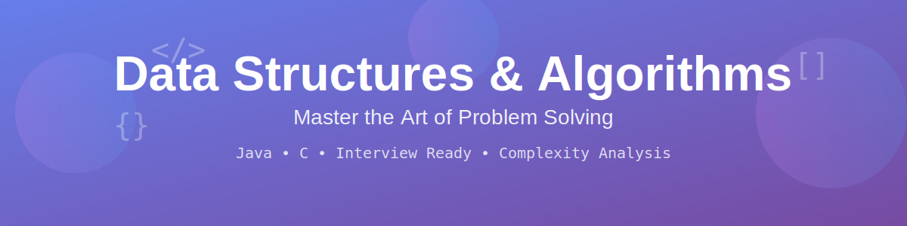
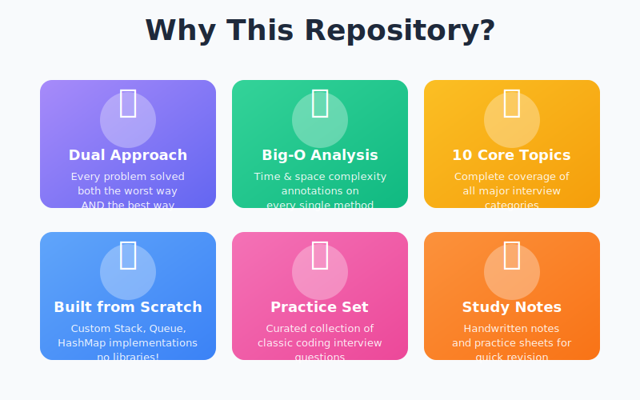
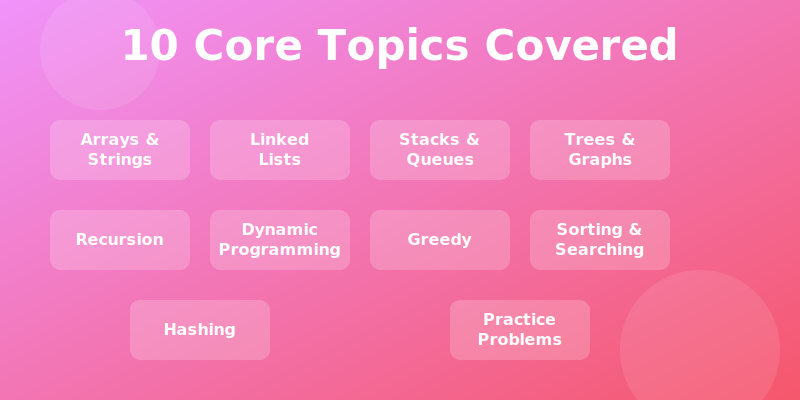
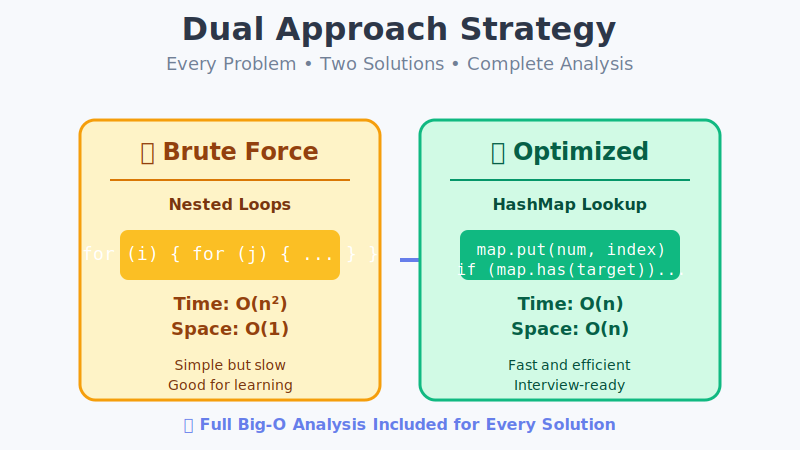
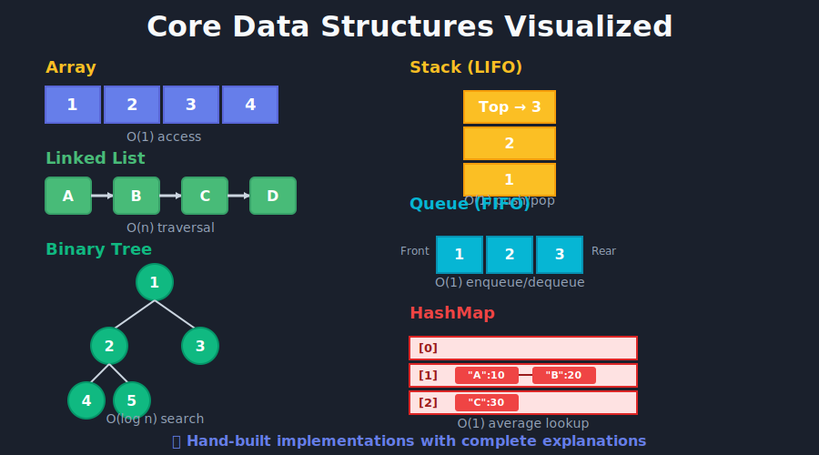

<div align="center">



# Data Structures & Algorithms 📘⚡

**A comprehensive, interview-ready collection of DSA implementations in Java & C**

[](https://www.java.com/)
[](https://en.wikipedia.org/wiki/C_(programming_language))
[](LICENSE)
[](CONTRIBUTING.md)

Every problem includes **both a brute-force and an optimal solution** with full time & space complexity analysis — so you can truly understand the _why_, not just the _how_.

[Explore Topics](#-topics--algorithms-at-a-glance) · [Get Started](#-getting-started) · [Contribute](#-contributing)

</div>

---

## 📌 Highlights

<div align="center">



</div>

---

## 📂 Repository Structure

```
DSA/
├── 01_Arrays_and_Strings/
│   ├── ArrayOperations.java        # Reverse, Max, Two Sum, Move Zeros, Duplicates, Missing Number
│   └── StringOperations.java       # Reverse, Palindrome, Anagram, First Non-Repeating Char
│
├── 02_Linked_Lists/
│   └── LinkedListOperations.java   # Reverse, Find Middle, Detect Cycle, Merge, Remove Nth Node
│
├── 03_Stacks_and_Queues/
│   └── StackQueueOperations.java   # Custom Stack & Queue, Balanced Parentheses, Min Stack, Queue via Stacks
│
├── 04_Trees_and_Graphs/
│   └── TreeOperations.java         # Inorder/Preorder/Postorder/Level-order, Max Depth, Symmetric Tree
│
├── 05_Recursion_and_Backtracking/
│   └── RecursionOperations.java    # Factorial, Fibonacci, Power, GCD, Permutations, Subsets, N-Queens
│
├── 06_Dynamic_Programming/
│   └── DynamicProgrammingOperations.java  # Fibonacci, Climbing Stairs, Coin Change, LCS, LIS, 0/1 Knapsack
│
├── 07_Greedy_Algorithms/
│   └── GreedyOperations.java       # Activity Selection, Fractional Knapsack, Huffman Coding, Kruskal MST, Dijkstra
│
├── 08_Sorting_and_Searching/
│   ├── SortingSearchingOperations.java  # Bubble, Insertion, Selection, Merge, Quick Sort; Linear & Binary Search
│   ├── insertionSort.c             # Insertion Sort in C
│   └── README.md
│
├── 09_Hashing_and_HashMaps/
│   └── Hash Map/
│       └── function.java           # Custom HashMap from scratch (put, get, remove, rehashing)
│
├── 10_Practice_Questions/
│   └── PracticeProblems.java       # Two Sum, Max Subarray (Kadane's), Valid Parentheses, Merge Sorted Lists
│
├── Hash Map/
│   └── function.java               # Additional HashMap implementation
│
├── DSA-Handwritten-Notes.pdf       # Quick-revision handwritten notes
├── Practice Sheet 1.pdf            # Practice problem sheet
└── README.md
```

---

## 🎯 Topics & Algorithms at a Glance

<div align="center">



</div>

### 1️⃣ Arrays & Strings

| Problem | Brute-force | Optimal | Complexity (Optimal) |
|---------|:-----------:|:-------:|:--------------------:|
| Reverse Array | Extra array `O(n)` space | Two-pointer swap | `O(n)` / `O(1)` |
| Find Maximum | Sort then pick last | Single pass | `O(n)` / `O(1)` |
| Two Sum | Nested loops `O(n²)` | HashMap lookup | `O(n)` / `O(n)` |
| Move Zeros | Extra array | In-place swap | `O(n)` / `O(1)` |
| Contains Duplicate | Nested loops `O(n²)` | HashSet | `O(n)` / `O(n)` |
| Missing Number | Sorting | Gauss sum formula | `O(n)` / `O(1)` |
| Reverse String | `+=` concat `O(n²)` | StringBuilder | `O(n)` / `O(n)` |
| Palindrome Check | Reverse & compare | Two pointers | `O(n)` / `O(1)` |
| Anagram Check | Sorting `O(n log n)` | Frequency count | `O(n)` / `O(1)` |
| First Non-Repeating | Nested loops `O(n²)` | LinkedHashMap | `O(n)` / `O(n)` |

### 2️⃣ Linked Lists

| Problem | Brute-force | Optimal |
|---------|:-----------:|:-------:|
| Reverse List | Extra array | In-place pointer reversal |
| Find Middle | Count + 2nd pass | Slow & fast pointers |
| Detect Cycle | HashSet `O(n)` space | Floyd's Tortoise & Hare |

### 3️⃣ Stacks & Queues

- Custom **Stack** (array-based) — push, pop, peek, overflow/underflow handling
- Custom **Queue** (circular array) — enqueue, dequeue, peek
- Balanced Parentheses, Min Stack, Queue using Two Stacks

### 4️⃣ Trees & Graphs

| Problem | Approach A | Approach B |
|---------|:----------:|:----------:|
| Inorder / Preorder / Postorder | Recursive | Iterative (stack) |
| Level Order Traversal | Recursive DFS | Iterative BFS (queue) |
| Max Depth | Recursive | BFS level count |
| Symmetric Tree | Recursive mirror check | Iterative (queue) |

### 5️⃣ Recursion & Backtracking

| Problem | Brute-force | Optimal |
|---------|:-----------:|:-------:|
| Factorial | Recursive `O(n)` stack | Iterative `O(1)` space |
| Fibonacci | Naive recursion `O(2ⁿ)` | DP / memoization `O(n)` |
| Power `x^n` | Loop multiply `O(n)` | Fast exponentiation `O(log n)` |
| Permutations | Extra space copies | In-place swap backtracking |
| Subsets | Bit manipulation | Backtracking |
| N-Queens | Brute-force grid check | Optimized column/diagonal sets |

### 6️⃣ Dynamic Programming

| Problem | Brute-force | Optimal |
|---------|:-----------:|:-------:|
| Fibonacci | `O(2ⁿ)` recursion | Bottom-up `O(n)` / `O(1)` space |
| Climbing Stairs | `O(2ⁿ)` recursion | DP `O(n)` / `O(1)` |
| Coin Change | Recursive `O(Sⁿ)` | Tabulation `O(n·S)` |
| LCS | Recursive `O(2ⁿ)` | 2-D DP table `O(m·n)` |
| LIS | `O(n²)` nested DP | Binary search `O(n log n)` |
| 0/1 Knapsack | `O(2ⁿ)` recursion | 2-D DP table `O(n·W)` |

### 7️⃣ Greedy Algorithms

| Problem | Brute-force | Optimal |
|---------|:-----------:|:-------:|
| Activity Selection | All subsets `O(2ⁿ)` | Sort by finish time `O(n log n)` |
| Fractional Knapsack | Check all combos | Sort by value/weight ratio |
| Huffman Coding | Brute-force tree | Priority queue `O(n log n)` |
| Kruskal's MST | Adjacency matrix | Union-Find `O(E log E)` |
| Dijkstra's Shortest Path | Adjacency matrix | Min-heap `O((V+E) log V)` |

### 8️⃣ Sorting & Searching

| Algorithm | Time (Worst) | Time (Best) | Space | Stable |
|-----------|:------------:|:-----------:|:-----:|:------:|
| Bubble Sort | `O(n²)` | `O(n)` | `O(1)` | ✅ |
| Insertion Sort | `O(n²)` | `O(n)` | `O(1)` | ✅ |
| Selection Sort | `O(n²)` | `O(n²)` | `O(1)` | ❌ |
| Merge Sort | `O(n log n)` | `O(n log n)` | `O(n)` | ✅ |
| Quick Sort | `O(n²)` | `O(n log n)` | `O(log n)` | ❌ |
| Linear Search | `O(n)` | `O(1)` | `O(1)` | — |
| Binary Search | `O(log n)` | `O(1)` | `O(1)` | — |

> Also includes an **Insertion Sort** implementation in **C** (`insertionSort.c`).

### 9️⃣ Hashing & HashMaps

- **Custom HashMap** built from scratch with:
  - Separate chaining (linked-list buckets)
  - Hash function, `put`, `get`, `remove`, `containsKey`
  - Dynamic **rehashing** when load factor > 2.0

### 🔟 Practice Questions (Interview Classics)

| Problem | Brute-force | Optimal |
|---------|:-----------:|:-------:|
| Two Sum | `O(n²)` nested loops | HashMap `O(n)` |
| Maximum Subarray | `O(n³)` all subarrays | Kadane's `O(n)` |
| Valid Parentheses | Manual tracking | Stack-based |
| Merge Sorted Lists | Array merge | In-place pointer merge |
| Reverse String | `+=` concat | Two-pointer swap |

---

## 💡 Understanding the Approach

<div align="center">



</div>

Each problem in this repository follows a systematic dual-approach methodology:

1. **Brute Force Solution** - The intuitive, straightforward approach that helps you understand the problem
2. **Optimized Solution** - The efficient approach using advanced data structures and algorithms
3. **Complexity Analysis** - Detailed Big-O notation for both time and space complexity
4. **Comparison** - Clear explanation of the trade-offs between approaches

This structure helps you not just memorize solutions, but truly understand algorithmic thinking!

---

## 🛠️ Data Structures Implementation

<div align="center">



</div>

All core data structures are implemented from scratch with detailed explanations:
- **Array Operations** - Manipulation, searching, and optimization techniques
- **Linked Lists** - Single, doubly-linked with pointer manipulation
- **Stacks & Queues** - Array and linked-list based implementations
- **Trees** - Binary trees, BST, traversals, and tree algorithms
- **Graphs** - Adjacency lists, DFS, BFS, and graph algorithms
- **Hash Maps** - Custom implementation with collision handling

---

## 🚀 Getting Started

### Prerequisites

- **Java** JDK 8+ — [Download](https://www.oracle.com/java/technologies/downloads/)
- **GCC** (for the C file) — included with MinGW on Windows or `build-essential` on Linux

### Run any Java file

```bash
cd 01_Arrays_and_Strings
javac ArrayOperations.java
java ArrayOperations
```

### Run the C file

```bash
cd 08_Sorting_and_Searching
gcc insertionSort.c -o insertionSort -lm
./insertionSort
```

---

## 🧠 How This Repo Is Organized

Each topic file follows a consistent pattern:

```java
// ==================== PROBLEM NAME ====================

/**
 * WORST APPROACH: Brief description
 * Time Complexity: O(...)
 * Space Complexity: O(...)
 */
public ResultType problemWorst(params) { ... }

/**
 * BEST APPROACH: Brief description
 * Time Complexity: O(...)
 * Space Complexity: O(...)
 */
public ResultType problemBest(params) { ... }
```

This side-by-side format makes it easy to **compare approaches**, understand **trade-offs**, and explain your reasoning in interviews.

---

## 📖 Additional Resources

| Resource | Description |
|----------|-------------|
| `DSA-Handwritten-Notes.pdf` | Quick-revision handwritten notes |
| `Practice Sheet 1.pdf` | Curated problem set for self-study |

---

## 🤝 Contributing

Contributions are welcome! Here's how you can help:

1. **Fork** the repository
2. **Create** a feature branch — `git checkout -b feature/new-problem`
3. **Commit** your changes — `git commit -m "Add: Problem Name"`
4. **Push** to the branch — `git push origin feature/new-problem`
5. **Open** a Pull Request

> Please follow the existing **Worst / Best approach** format and include complexity annotations.

---

## 👤 Creator

- 💼 **Created by**: Kshama Mishra

---

<div align="center">


Created by Kshama Mishra

</div>
